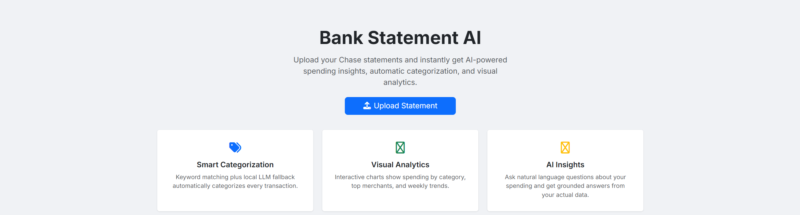
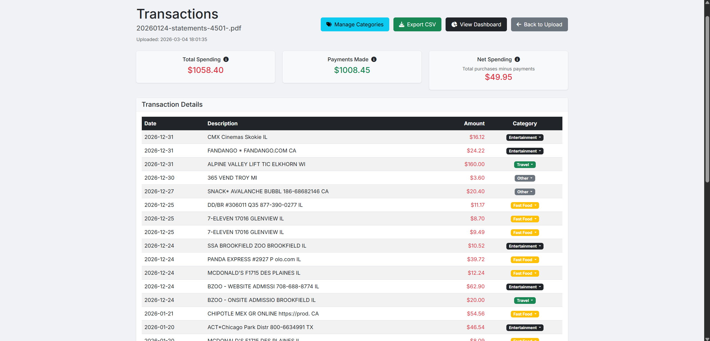
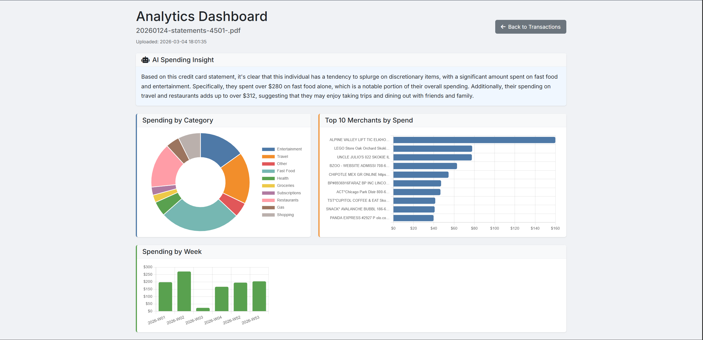
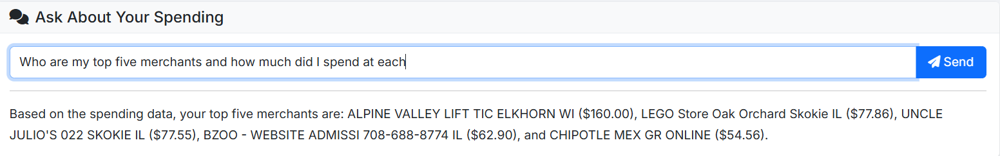
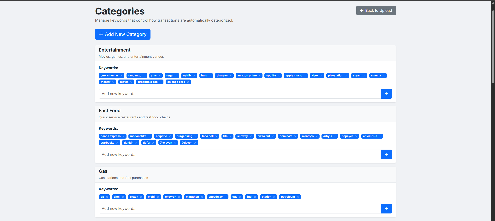

# Bank Statement AI

> 🎥 Demo video coming soon — link will be added here

A full-stack AI-powered financial data pipeline that automatically extracts, categorizes, and analyzes bank statements using a two-layer categorization architecture — keyword matching backed by a locally-hosted LLM — with zero cloud AI dependencies. All inference runs on your own machine via Ollama.

## Features

- **PDF Parsing** — Upload Chase credit card statements (PDF) and extract every transaction automatically using pdfplumber
- **Smart Categorization** — Keyword-based matching categorizes ~95% of transactions instantly; Ollama (llama3) handles the rest as a local LLM fallback
- **Category Management** — Add keywords to any category, create custom categories, remove keywords via a confirmation modal
- **Analytics Dashboard** — Three Chart.js charts per statement: spending by category (donut), top 10 merchants (horizontal bar), spending by week (vertical bar)
- **AI Spending Insights** — Auto-generated plain-English spending summary on the dashboard, powered by llama3 running locally via Ollama
- **AI Chat** — Ask natural-language questions about any statement ("What should I cut back on?") and get answers from the local LLM
- **CSV Export** — Download any statement's transactions as a CSV (Date, Description, Amount, Type, Category)
- **Duplicate Detection** — Re-uploading a statement skips already-stored transactions; the UI reports how many were new vs. skipped
- **Backup & Restore** — One-click SQLite database backup with timestamped files, download to local disk, and restore from any backup
- **Settings Page** — Configure Ollama URL and model, trigger backups, view database statistics

## How It Works

Bank Statement AI uses a two-layer categorization pipeline designed to maximize accuracy without relying on any external AI service. When a statement is uploaded, the file is stored to AWS S3 and its text is extracted locally via pdfplumber; each transaction then passes through a keyword matcher that resolves roughly 95% of transactions in milliseconds using a configurable `categories.json` ruleset. Any transaction that escapes keyword matching is forwarded to a locally-running Ollama instance (llama3), which classifies it using a structured prompt constrained to valid category names — preventing hallucinations while handling merchants the keyword list has never seen. The same Ollama instance powers the analytics dashboard's auto-generated spending summary and the interactive AI chat, both of which receive your actual spending data as context so every response is grounded in real numbers rather than generic advice.

## Screenshots










## Tech Stack

| Layer | Technology |
|---|---|
| Backend | Python 3, Flask |
| Database | SQLite (via Python's built-in `sqlite3`) |
| PDF Parsing | pdfplumber |
| OCR (images) | Pillow |
| Categorization | Keyword matching + Ollama (llama3) |
| AI / LLM | Ollama — runs locally, no external AI API needed |
| File Storage | AWS S3 via boto3 (optional) |
| Frontend | Bootstrap 5.3, Vanilla JS, Chart.js 4.4 |
| Fonts / Icons | Google Fonts (Inter), Font Awesome 6 |

## Setup

### 1. Clone the repo and install dependencies

```bash
git clone https://github.com/your-username/bank-statement-ai.git
cd bank-statement-ai
pip install -r requirements.txt
```

### 2. Configure environment variables

```bash
cp .env.example .env
# Edit .env with your values
```

### 3. Set up the database

```bash
python -c "from database.models import Database; Database().initialize()"
```

### 4. Install and start Ollama (required for AI features)

Download from [ollama.com](https://ollama.com), then:

```bash
ollama pull llama3
ollama serve
```

### 5. Run the app

```bash
python app.py
```

Open [http://localhost:5000](http://localhost:5000) in your browser.

## Environment Variables

See `.env.example` for all available variables. Key ones:

| Variable | Default | Description |
|---|---|---|
| `OLLAMA_URL` | `http://localhost:11434` | Base URL of your Ollama instance |
| `OLLAMA_MODEL` | `llama3` | Model to use for categorization and AI insights |
| `S3_BUCKET_NAME` | — | AWS S3 bucket for statement file storage |
| `FLASK_DEBUG` | `True` | Set to `False` in production |

## Project Structure

```
Bank_Statement_AI/
├── app.py                    # Flask routes and application logic
├── config.py                 # Configuration settings
├── database/
│   └── models.py             # SQLite schema and queries
├── ocr/
│   ├── pdf_processor.py      # PDF text extraction (pdfplumber)
│   ├── image_processor.py    # Image OCR (Pillow)
│   └── parser.py             # Transaction parsing and storage
├── categorization/
│   ├── keyword_categorizer.py
│   ├── ollama_categorizer.py # LLM fallback + AI dashboard features
│   ├── category_manager.py
│   └── categories.json       # Configurable keyword lists
├── utils/
│   ├── aws_handler.py        # S3 upload/download
│   ├── export_utils.py       # CSV export
│   ├── backup_utils.py       # Database backup/restore
│   └── file_handler.py       # Upload validation
├── templates/
│   ├── base.html
│   ├── index.html            # Homepage
│   ├── upload.html           # Upload + file list
│   ├── transactions.html     # Transaction table with edit/export
│   ├── reports.html          # Analytics dashboard + AI chat
│   ├── categories.html       # Category/keyword management
│   └── settings.html         # Backup, restore, Ollama config
└── static/
    ├── css/style.css
    └── js/main.js
```

## Notes

- All AI inference (categorization, summaries, chat) runs locally via Ollama — no data is sent to any external AI service
- Statement files are uploaded to AWS S3 for storage; S3 integration is optional and the app works fully without it
- Tested primarily with Chase credit card PDF statements
